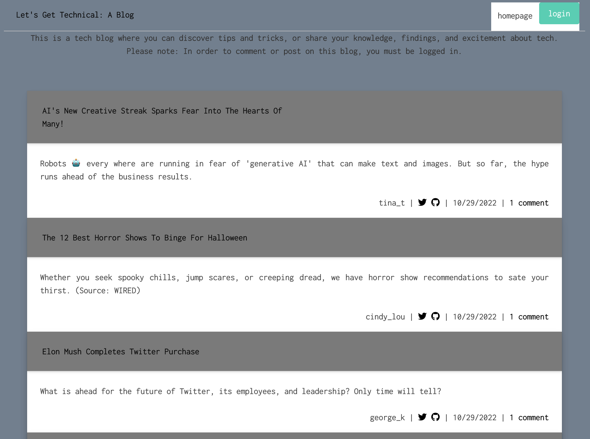
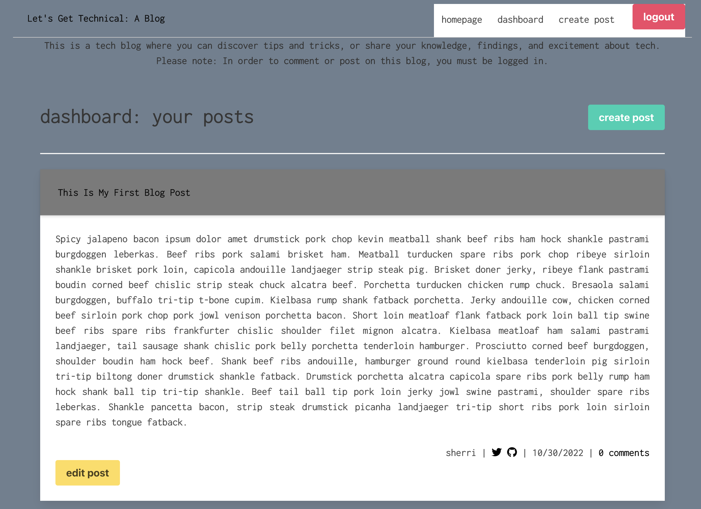
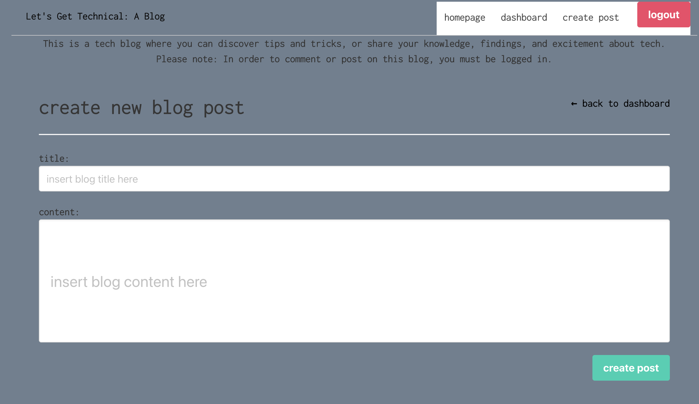
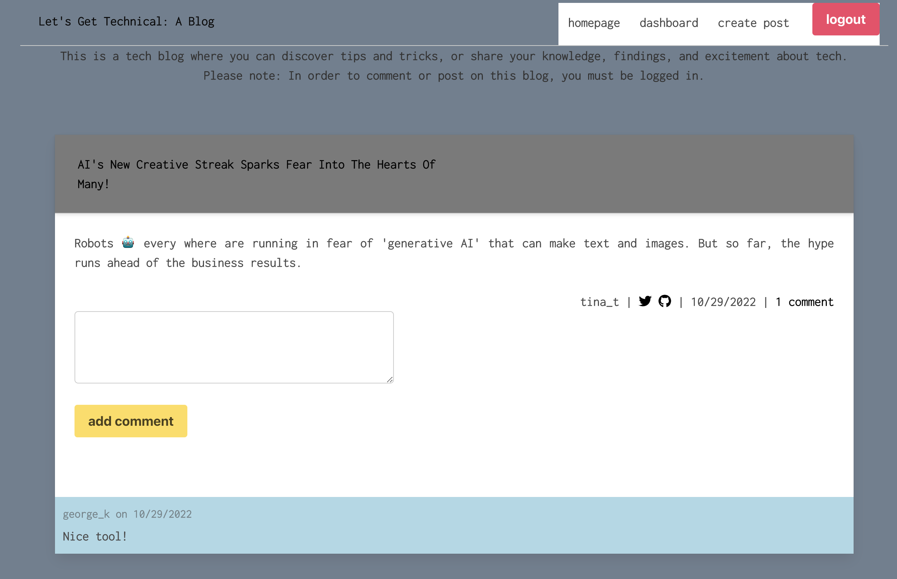
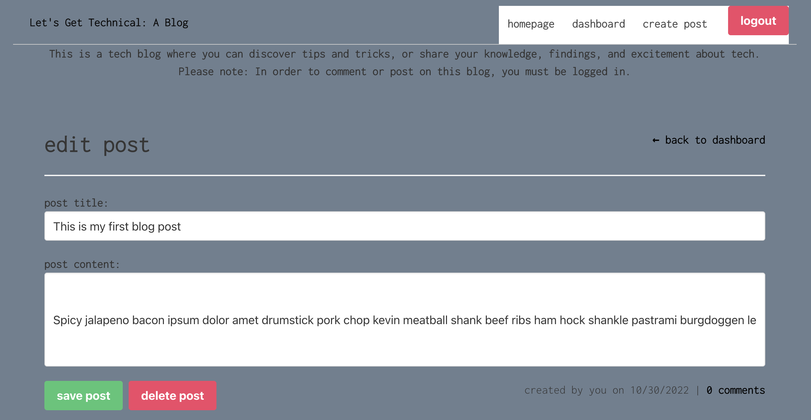

# MVC Tech Blog

  
## Description
This application is a Tech Blog where developers can publish their blog posts and comment on other developers’ posts.
  
## User Story

```md
AS A developer who writes about tech
I WANT a CMS-style blog site
SO THAT I can publish articles, blog posts, and my thoughts and opinions
```
## Screenshots







## Links
Deployed Application: https://enigmatic-coast-39915.herokuapp.com
GitHub Repository: https://github.com/iamjoyfulgirl/mvc-tech-blog


## Questions?
Questions about this project can be directed to:
- Email: sherri.a.knight@gmail.com. 
- You can view more of my projects at https://github.com/iamjoyfulgirl.

-----------

MVC Tech Blog - Copyright 2022 Sherri Knight
